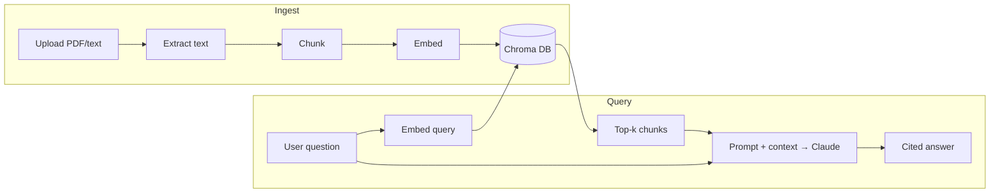

# Talk to Documents (RAG Assistant)

Upload PDFs or text files, ask questions in plain English, and get answers **with citations** — powered by Retrieval-Augmented Generation.

## Stack

| Component | Role |
|-----------|------|
| **Claude (Anthropic API)** | Answer generation |
| **sentence-transformers** | Local embeddings (`all-MiniLM-L6-v2`) |
| **Chroma** | Local vector database |
| **Streamlit** | Chat UI with file upload |

## Architecture



## Project structure

```
rag-assistant/
├── docs/                 # your PDFs and text files
├── ingest.py             # load → chunk → embed → store
├── rag.py                # retrieve → generate cited answer
├── app.py                # Streamlit chat UI
├── evaluate.py           # retrieval + answer quality checks
├── embeddings_demo.py    # semantic similarity intuition demo
├── demo_memory.py        # multi-turn conversation demo
├── test_key.py           # Claude API smoke test
└── chroma_db/            # auto-created vector store
```

## Setup

```bash
python -m venv venv
venv\Scripts\activate          # Windows
pip install -r requirements.txt

set ANTHROPIC_API_KEY=sk-ant-your-key   # Windows cmd
# $env:ANTHROPIC_API_KEY="sk-ant-..."   # PowerShell
```

## Usage

```bash
# 1. Verify API key
python test_key.py

# 2. Index documents
python ingest.py

# 3. Try retrieval + generation
python rag.py

# 4. Multi-turn memory demo
python demo_memory.py

# 5. Run evaluation
python evaluate.py

# 6. Launch the UI
streamlit run app.py
```

## How it works

1. **Ingest** — PDFs/text are loaded, chunked, embedded, and stored in Chroma with source metadata.
2. **Retrieve** — Your question is embedded and matched against stored chunks (top-k).
3. **Generate** — Claude answers using only the retrieved context, with `[n]` citations.
4. **Memory** — Prior chat turns are passed on each call so follow-up questions work.

## Evaluation

`evaluate.py` measures:

- **Retrieval hit rate** — did the expected source appear in top-k?
- **Answer keyword match** — does the answer contain expected terms?

Change `chunk_size`, `k`, or overlap in `ingest.py` / `rag.py`, rerun `evaluate.py`, and compare scores.
